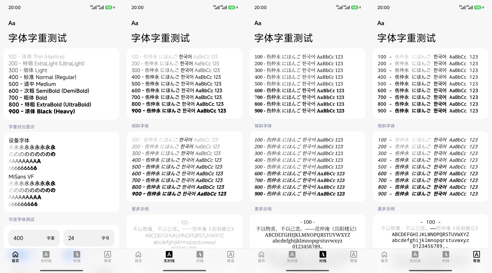

# Font Weight Test

A simple, cross-platform application to test and visualize font weights and variable fonts. Built with [Compose Multiplatform](https://www.jetbrains.com/compose-multiplatform/).

## Features

- **Font Comparison**: Visualize Sans Serif, Serif, and Monospace families.
- **Variable Fonts**: Interactive controls for variable font axes.
- **Custom Text**: Input custom text to test rendering.
- **Multiplatform**: Runs on Android, iOS, Windows, macOS, and Linux.

## Screenshot

 
    

