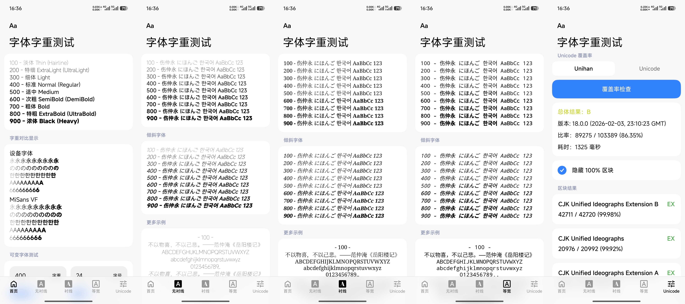

# Font Weight Test

A cross-platform application to test and visualize font weights, variable fonts, and Unicode coverage. Built with [Compose Multiplatform](https://www.jetbrains.com/compose-multiplatform/), with native text rendering on each platform for accurate results.

## Features

- **Font Weight Display**: View all 9 weight steps (Thin–Black) with named labels using the system font.
- **Font Family Comparison**: Visualize Sans Serif, Serif, and Monospace families across all weights.
- **Variable Font Controls**: Interactive sliders for font weight (1–1000) and font size, with custom text input.
- **Font Comparison**: Side-by-side comparison of the device font and the bundled MiSans VF variable font.
- **Unicode Coverage**: Browse Unicode blocks and check glyph support of the system font.
- **Native Rendering**: Uses platform-native text APIs (Android, iOS, macOS) via `NativeVariableText` for pixel-accurate variable font rendering.
- **Multiplatform**: Runs on Android, iOS, Desktop (Windows, Linux), and macOS native (arm64).

## Screenshot

 
    

